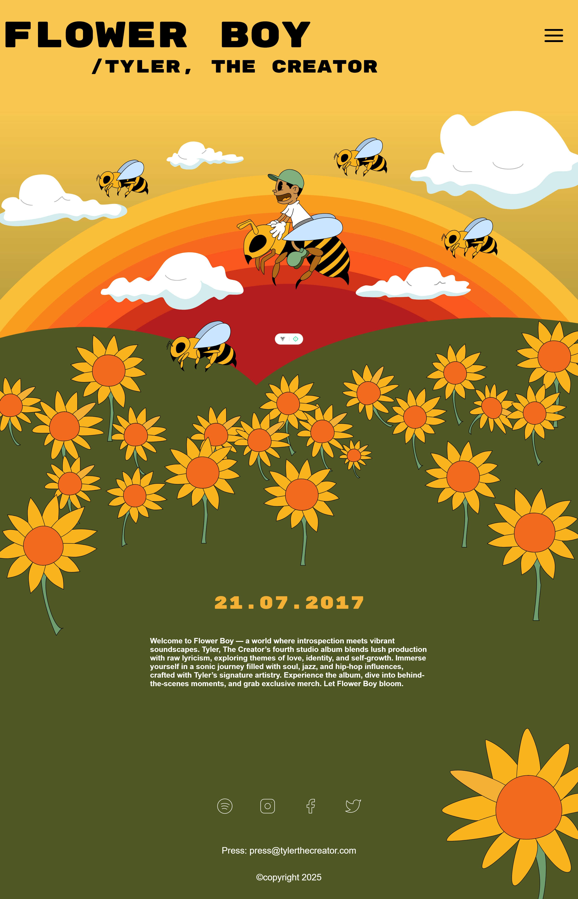
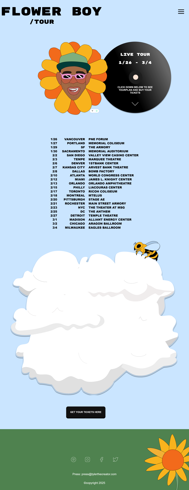
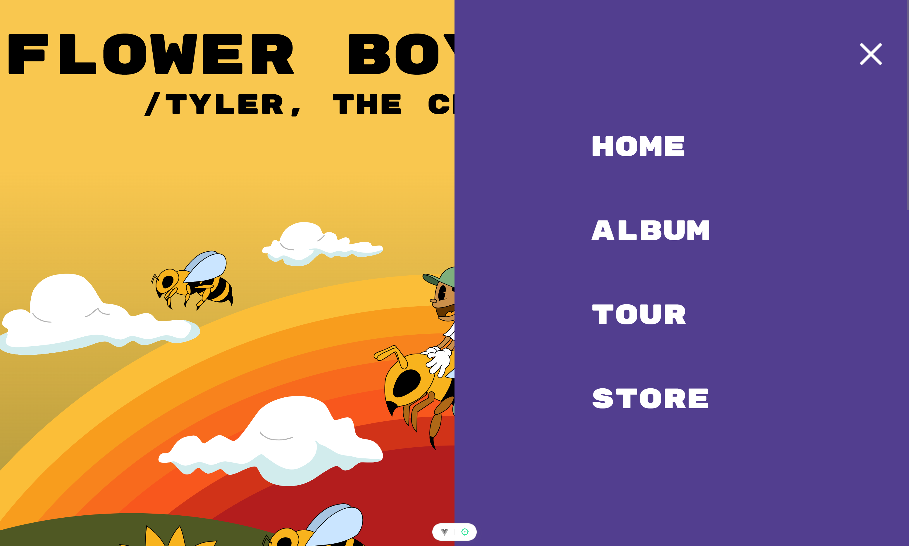
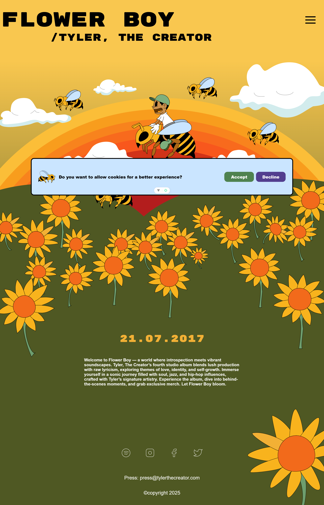
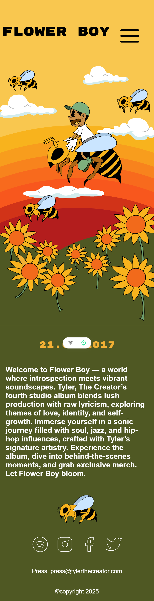
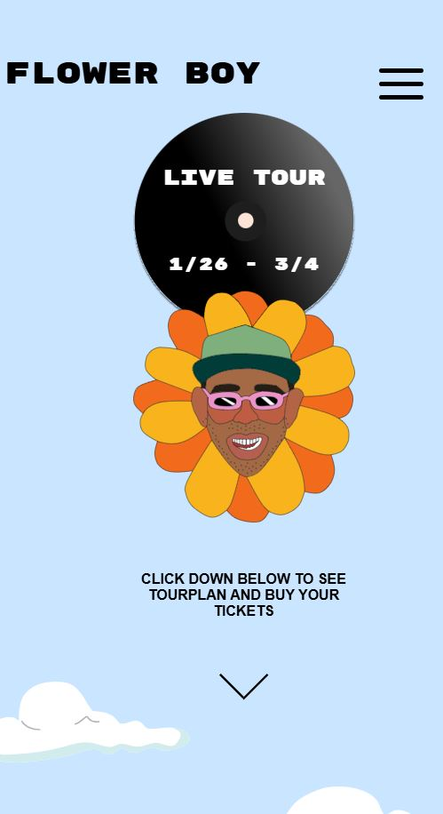
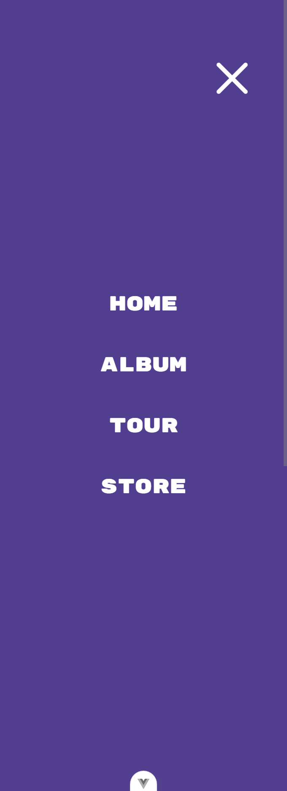
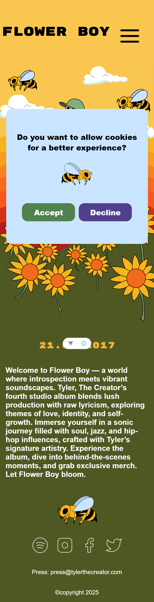

 # FLOWER BOY  

This is a project that was developed during our course "Graphical tools for interface design" - where we took a deep dive into designing a webpage from scratch and then handing it over to another group for them to develop. 
As such we of course recieved a design from another group as well - which is the project you are currently looking at.
This project took inspiration from the album cover of Flower Boy, and the focus is on a fun and playful design that is still responsive and has good accessability. 

## 🚀 Project Overview 

Our project is a fun and interactive webpage design with the sole purpose of letting users know more about the album "FLOWER BOY" as well as the schedule for the artists tour.

Our project features:
 - **Modern and accessible HTML structure**: Semantic elements are used to ensure clarity and enhance accessibility.

 - **Responsive styling with SASS**: The application is responsive, with mobile-first design principles supported by modular SASS architecture.

- **Modular and maintainable codebase thanks to Vue**: Vue was used as a framework to enhance code structure, ensuring a component based structer to aid in scalability.

 - **Team collaboration**: Our team used GitHub workflows, with each member contributing through pull requests and thorough code reviews to maintain quality and consistency.

## 🖱️ Demo 
[Click here to view the demo](https://medieinstitutet.github.io/fed24d-grafiska-verktyg-dabbagam/)

## 📸 Screenshots 

**Home page - Desktop** 

**Tour page - Desktop** 

**Menu - Desktop**

**Cookie bar - Desktop** 

**Home page - Mobile**

**Tour page - Mobile** 

**Menu - Mobile**

**Cookie bar - Mobile** 

## 🌟 Features <!--Features of the project-->

- **Responsive Design**: The page adapts to all screen sizes, ensuring a smooth experience across devices.

 - **Simple Navigation**: Users can easily navigate through the site with clear and intuitive UI elements.

- **Search Engine Optimization (SEO)**: Implemented SEO best practices, including meta tags, descriptive titles, and optimized content to improve search visibility. 

### Functionality

The application is divided into two main sections:

**1. Home Page**: 
 - Welcomes users with a colorful and animated Home/Landing page. 
 - Provides information about the album and tour. 
 - Includes a hamburgermenu with clear options. 

**2. Tour Page**: 
- Displays the date of the tour, as well as a link to get to the "Buy Tickets Here" button. 
- Features a list of the full tour. The list adapts to different screensizes. 
- Includes a clickable button where the user can easily buy tour tickets. 

## 💻 Tech Stack <!-- Techstack + tools for the project = What has been used in the making of it all -->
 <!-- Made with https://shields.io/ , check how & then update-->

 

## 🔧 Tools: 

 

## 🔍 Validation & Lighthouse analysis <!-- Info & screenshots of the validations. Example for link: (public/screenshots/HTMLValidation.png), link to the img files in the project. -->

**HTML Validation**

**Lighthouse report**

The site has been validated using W3C tools to ensure compliance with proper HTML5, CSS3, and ARIA standards.

A Lighthouse analysis was performed to optimize the application’s performance, accessibility, and SEO. Based on the results, improvements were made to enhance loading speed, accessibility for all users, and search engine visibility, contributing to a smoother and more user-friendly experience. 

<!--EXAMPLE 

**HTML Validation**

**Lighthouse report**

-->

## 📃 Original information provided by team Kungskobrorna 

### Instructions
Link to our design in Figma: https://www.figma.com/design/gu8QVipNbMtUVRn9J2EZmO/FLOWER-BOY?node-id=13-3&t=V303dfNKdXUHCtmL-1 

### Grid
Desktop: 6 grid layout, 32px margin, 16px gutter.

Mobile & Tablet: No grid used, feel free to do as you please. 

### Fonts
Primary font (h1-h3): Rubik mono one 

Secondary font (h4-h6 + strong): Arial (black) 

Paragraph: Arial (bold)

See font-sizes in Figma, but feel free to adjust to taste/design. 

### Buttons
**Primary buttons**
Default: #000000 font: #ffffff

Hover: #f9c74f font: #ffffff

Pressed: #df4b32 font: #ffffff

Disabled: #c9c7c7 font: #646464

**Cookie buttons**
Accept: #7eaf7d  font: #ffffff, hover: #f9c74f font: #ffffff

Decline: #523e8f font: #ffffff, hover: #df4b32 font: #ffffff

**Primary arrow**
Default: #ffffff + drop shadow

Hover: #f9c74f + drop shadow

Pressed: #df4b32 + drop shadow

**Secondary arrow**
Default: #000000 + drop shadow

Hover: #7eaf7d  + drop shadow

Pressed: #df4b32 + drop shadow

**Store cancel button**
Default: #df4b32 font: #ffffff 

Hover: #000000 font: #df4b32

Pressed: #0000000 font: #ffffff

**Store add button**
Default: #ffffff font: #000000

Hover: #f9c74f font: #ffffff

Pressed: #df4b32 font: #ffffff

**Store drop-down**
Hover: Black underline

**Links menu**
Default: #ffffff 
Hover: #f9c74f

### Animations
On start-page: The bees and clouds should move across the page harmoniously, maybe the flowers move with the wind. 

When the menu is opened it should slide in from the left (see prototype in Figma). And when closed it should snap back quickly. 

When the down arrow is pressed there should be a smooth scroll down to the next section on the page. 

### About the design
We took inspiration from the album cover of Flower Boy. We wanted to make a playful digital version of the album cover but in a more cartoonish style that feels alive. All the following design choices were made with this in mind. Based on that we have choosen a colourful palette that takes the user on a journey through the album. The font-style that we have choosen is a combination of the original font that is used on the album but with a more playful vibe. We have tried to keep the same style on all the buttons to ensure a coherent design across the pages.

## 🎯 Learning Journey 

-To be added-

### Category 1

### Category 2 

## ✍️ Authors 
Created by: 
- [Lenita Dahlin](https://github.com/LDMI-24)
- [Malin Rosenquist](https://github.com/MalinRosenquist)

## 🤝 Credits

Design done by team Kungskobrorna:

- [Omar](https://github.com/OmarAlawi16)
- [Matilda](https://github.com/matildasoderhall)
- [Valentin](https://github.com/Valentin-dot-com)
- Amanda (GitHub link missing, will be updated)

This project was developed as part of the curriculum at [Medieinstitutet](https://medieinstitutet.se/) during our first year of studies.

